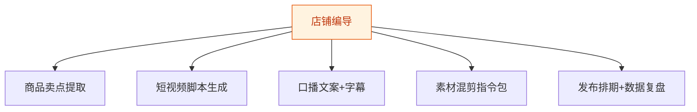

# 店铺编导 — 工作流流程图

本员工共 **5 条工作流**，下辖 **5 个原子技能**。

## 总览

## 分条详情

### 商品卖点提取

| 项目 | 内容 |
|------|------|
| 触发 | 人工 |
| 复杂度 | `S` |
| 阶段 | `P1` |
| ROI | 月省选题 8h≈¥240 |

### 短视频脚本生成

| 项目 | 内容 |
|------|------|
| 触发 | 人工 |
| 复杂度 | `S` |
| 阶段 | `P1` |
| ROI | 月省写稿 15h≈¥450 |

### 口播文案+字幕

| 项目 | 内容 |
|------|------|
| 触发 | 人工 |
| 复杂度 | `S` |
| 阶段 | `P1` |
| ROI | 直接进剪辑流程，零二次加工 |

### 素材混剪指令包

| 项目 | 内容 |
|------|------|
| 触发 | 人工 |
| 复杂度 | `M` |
| 阶段 | `P2` |
| ROI | 剪辑外包 ¥50-100/条的半价替代 |

### 发布排期+数据复盘

| 项目 | 内容 |
|------|------|
| 触发 | 定时（每日/每周） |
| 复杂度 | `M` |
| 阶段 | `P2` |
| ROI | 复盘覆盖率决定迭代速度 |

## 汇总表

| # | 工作流 | 阶段 | 复杂度 | 触发 | 涉及技能数 |
|---|--------|------|--------|------|-----------|
| 1 | 商品卖点提取 | `P1` | `S` | 人工 | 1 |
| 2 | 短视频脚本生成 | `P1` | `S` | 人工 | 2 |
| 3 | 口播文案+字幕 | `P1` | `S` | 人工 | 2 |
| 4 | 素材混剪指令包 | `P2` | `M` | 人工 | 1 |
| 5 | 发布排期+数据复盘 | `P2` | `M` | 定时（每日/每周） | 2 |

---

*本图由 build_p0_assets.py 自动生成*
