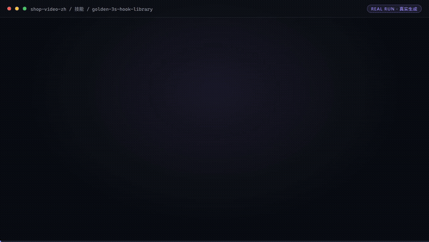

# 黄金 3 秒钩子库

> 原子技能 ｜ 属于「店铺编导」 ｜ 电商小卖家 客群

钩子模式按类目检索




🎬 **[▶ 观看高清完整版（mp4）](docs/assets/demo.mp4)** — 四幕创作叙事：业务钩子 → 真实执行 → 要点到成稿演变 → 交付物

---

## 这是什么

`黄金 3 秒钩子库` 是一个**原子技能**资产。它不是一个软件，也不是一段代码，
而是**可以直接复制粘贴到任意 AI 工具里使用的提示词资产**。

| 特性 | 说明 |
|------|------|
| 零 API Key | 不需要任何密钥 |
| 零部署 | 没有服务端、没有脚本 |
| 平台无关 | Coze / WorkBuddy / Dify / Claude / ChatGPT 均可 |
| 用户自备算力 | 模型来自你自己的订阅 |

## 快速开始（3 步）

```text
1. 打开 skills/golden-3s-hook-library/prompt.txt
2. 全文复制
3. 粘贴到你的 AI 工具，按输入规格提供数据
```

## 文件地图

```text
├── README.md                ← 本文件
├── SKILL.md                 ← 资产定义（元信息 / 契约 / 边界）
├── prompt.txt               ← 提示词本体（核心交付物）
├── schema.json              ← 输入输出契约（机器可读）
├── examples/                ← 示例输入与输出
└── docs/                    ← 10 项配套文档
    ├── 01-usage-manual.md      安装使用手册
    ├── 02-architecture.md      业务架构图
    ├── 03-flow.md              流程图
    ├── 04-examples.md          使用示例
    ├── 05-media.md             截图和录屏
    ├── 06-scenarios.md         使用场景（适用 / 不适用）
    ├── 07-audience.md          用户群体
    ├── 08-value.md             解决问题与价值
    └── 09-test-report.md       测试报告
```

## 输入输出

| 项 | 内容 |
|----|------|
| 输入 | 类目→钩子候选 |
| 输出 | 钩子模式按类目检索 |

## 面向谁 / 解决什么

- **用户群体**：淘宝 / 抖店 / 拼多多 / 小红书店铺小卖家
- **典型场景**：店铺日常运营（上架、接待、售后、评价维护）
- **解决痛点**：上架、客服、评价、作图四线作战，人力不够
- **衡量指标**：转化率、响应时长、差评率、动销率

详见 [用户群体](docs/07-audience.md) 与 [解决问题与价值](docs/08-value.md)。

## 合规

- 本资产输出为 **AI 辅助生成内容**，交付前必须经人工审核
- 请按所在平台要求完成 **AI 生成内容标识**
- 连接器只走两条合规路径：**官方 API**、**用户自行导出的数据**

---

*本资产遵循 [bangwozuo 数字员工资产规范](https://github.com/bangwozuo/digital-employee-spec) v3.0*
